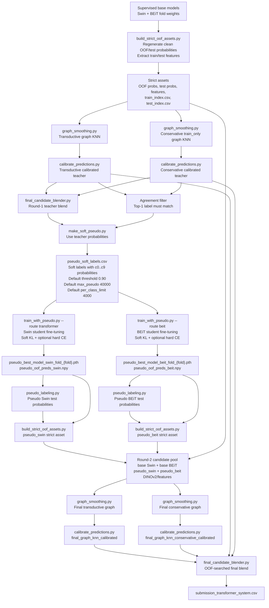

# Pseudo Label Flow

This flow summarizes the pseudo-labeling part of the late-stage `kaggle2`
Transformer system. It starts after supervised Swin/BEiT base models and strict
assets are available.

## Key Guardrails

- The teacher is not a single raw model. It is built from graph-smoothed and
  calibrated Swin/BEiT candidates.
- Soft pseudo labels keep the full `c0..c9` distribution, instead of only the
  hard top-1 class.
- By default, pseudo samples are kept only when transductive and conservative
  teachers agree on top-1.
- Pseudo fine-tuning starts from supervised fold weights and saves separate
  `pseudo_best_model_*` weights, so base weights are not overwritten.
- Round 2 treats pseudo students as new candidates, then repeats graph smoothing,
  calibration, and final blending.

